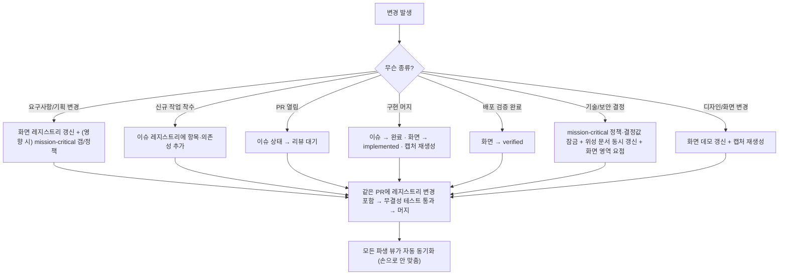

# PlayBoard Build & Operate Harness

## 역할

이 스킬은 **PlayBoard**를 호스트 프로젝트에 **재현(build)**하고 **운영(operate)**한다. PlayBoard는 정적 문서가 아니라 **레지스트리(구조화 데이터)에서 모든 화면을 파생 렌더**하는 **단일 진실 공급원(SoT) 표면**이다 — 기획·이슈·구현현황·일정·기술정책·디자인 실체가 하나의 살아있는 보드로 수렴한다.

```
6개 레지스트리(SoT) ──파생──▶ 10개 라우트/표면 (상황판·계획·일정·통계·정책·스펙·데모·흐름)
        ▲                              │
        └──── 같은 PR에서 동시 갱신 ◀────┘  (손으로 두 곳을 안 맞춘다)
```

이 스킬은 **프레임워크·테마 비종속**이다. 색·폰트·간격 같은 심미는 호스트 디자인 시스템에 위임하고, "무슨 요소가 어디에 어떤 형태로 놓이고 무엇을 표현하는가"와 "효용을 유지하는 운영 규칙"만 규정한다. **전체 페이지별 와이어프레임·필드 계약·운영 규칙의 완본**은 이 스킬 패키지의 `reference/` 디렉터리에 동봉되어 있다:

- `reference/PLAYBOARD_FINAL_SPEC_DEFINITION.md` — 재현 스펙(정보구조·데이터모델·페이지별 와이어·파생 알고리즘·무결성·재현 체크리스트).
- `reference/PLAYBOARD_BENEFIT_N_OPERATION_RULE.md` — 효용·운영 규칙(왜 쓰고 어떻게 운영해 효용을 유지하는가).

> **레퍼런스 찾는 법:** 이 repo 안에서 작업 중이면 **패키지 루트 기준 `reference/`**(SKILL.md 기준 상대경로 `../../../reference/`). SKILL.md만 설치된 환경(curl 개인 설치)이면 원격 `https://github.com/wild-mental/playboard-skill/tree/main/reference` 에서 가져와 읽고 그대로 적용한다.

---

# 제1원칙 & 핵심 성질 (불가침)

**제1원칙:** **표시되는 모든 것은 레지스트리에서 파생한다. 두 곳을 손으로 맞추지 않는다.** 사실(fact)은 레지스트리 한 곳에만 적고, 보드의 모든 뷰는 그것을 계산해 보여준다. 이 원칙이 깨지면(보드와 실제가 따로 노는 순간) 5대 효용이 동시에 무너진다.

재현 시 반드시 유지할 4가지 성질:

1. **레지스트리 → 파생 뷰 단방향.** 모든 표면은 6개 레지스트리에서 계산한다. 화면에 하드코딩된 목록을 두지 않는다.
2. **하나의 산출물 = 다관점 동시 표현.** 같은 화면이 썸네일 카드·상태 칸반·커버리지 매트릭스 행·시나리오 walkthrough·기술 스펙·데스크톱/모바일 흐름에서 **동일 식별자(`plane/slug`)**로 반복 등장한다.
3. **상태 인코딩 전면 일관성.** 같은 상태는 모든 표면(카드·표·그래프 노드·간트 막대)에서 **동일 배지 형태**로(형태·라벨은 스펙, 색은 테마 위임).
4. **노출 게이트.** production 기본 비공개(404), 개발/프리뷰에서만 노출. `isEnabled() = (env != production) OR (flag == true)`.

---

# 6개 레지스트리 (데이터 모델 — SoT)

PlayBoard의 SoT는 6개 레지스트리다. 도메인 고유 명칭은 일반 용어로 치환해 읽는다(아래 § 부록 매핑).

| 레지스트리 | 핵심 필드(계약) | 비고 |
|-----------|-----------------|------|
| **Screen(산출물 화면)** | `plane, slug, title, route, designSpecType, flowNote, status, statusNote?, workItems[], requirementRefs[], implLocation?, engineering` | 추적 단위. `route`=설명 대상 실제 앱 경로 |
| **Engineering(제어 스펙)** | `authGate, clientActions[], serverActions[], dataReads[], dataWrites[], telemetryEvents[], exceptionStates[], controlAreaNotes{area→요점}` | 빈 계약 = "미정" 아니라 "기재 누락" |
| **Plane(평면)** | 최상위 분류축(2~4개 권장: 주사용자/운영자/시스템상태) | 흐름과 보통 1:1 |
| **Status(구현 상태)** | 순서 있는 4단계: `미착수(기획확정) → 부분구현 → 구현·머지완료 → 검증완료` | 칸반·매트릭스·카운트의 단일 정렬 기준 |
| **WorkItem(작업 항목)** | `id, title, phase, status(미착수/리뷰대기/완료), externalRefs?, dependsOn[], screens[], doc` | DAG(비순환 보장). Phase=명시 순서 배열 |
| **ControlArea(제어 영역)** | `area, goal, summary, policies[{statement,detail}], decisions[{name,value}], standards[{title,path}], workItems[], gaps[]` | 횡단 비기능 정책축(보안·성능·장애복구…) |
| **Flow(흐름)** | 한 평면의 화면들을 **순차 시나리오** 또는 **독립 케이스 집합**으로 묶음 | 평면당 1, 시스템상태=비순차 |

**파생 개념: Wave(병렬 착수 묶음)** = WorkItem DAG에서 동시 착수 가능한 그룹(§ 파생 알고리즘).

`Screen.engineering.controlAreaNotes[area]`의 **키 존재 여부**가 구현 통계 매트릭스의 `●` 채움을 결정한다 — 이게 매트릭스와 영역 상세의 "대응 화면"을 동시에 채운다(이중 정의 금지).

---

# 10개 라우트 & 표면

1개 인덱스 + 9종 표면 = **10 라우트**. 없는 파라미터는 **404**(파라미터 검증 = 레지스트리 조회).

| 라우트 | 표면 | 무엇을 표현 |
|--------|------|-------------|
| `/` | 상황판 인덱스 | 6 레지스트리 요약 + 모든 표면으로 분기(허브). 6타일 세로 스택 |
| `/plan` | 실행 계획 | WorkItem DAG(모달) + Phase별 단계 표 |
| `/schedule` | 일정표 | DAG에서 파생한 Wave(Gantt + 카드, 차단 선행 표기) |
| `/implement-summary` | 구현 통계 매트릭스 | 화면 × {구현상태, 제어영역 커버리지●}, 정렬 가능 |
| `/control-area/:area` | 제어 영역 상세 | 목표·요약·확정 정책·결정값·기준 문서·대응 화면·관련 작업·미해소 갭(5섹션) |
| `/spec/:plane/:slug` | 산출물 기술 스펙 | 화면 계약 + 엔지니어링 제어 + 연결 작업 + 캡처 |
| `/screens/:plane/:slug` | 화면 데모 | 실 코드·반응형 목업(캡처 대상, 모바일 iframe 소스) |
| `/scenario/:flow` | 시나리오 walkthrough | 순차 흐름 전용: 좌 캡처/우 엔지니어링 사양 |
| `/ux-flow/:flow` | 데스크톱 흐름 오버뷰 | 읽기 폭에서 캡처를 순서대로 통독 |
| `/mobile-flow/:flow` | 모바일 흐름 오버뷰 | 데모 라우트를 모바일 폭 iframe 폰 프레임으로 |

**공유 골격:** sticky PlayBoard 내비(breadcrumb + 4 섹션 탭[상황판·실행계획·일정표·구현통계], 현재 강조 `aria-current`) + 콘텐츠 타일 세로 스택(인접 타일 배경 교차). 상호작용 "섬"은 **5개뿐** — PlayBoardNav, ScreenBoard(타일/칸반 토글), SortableMatrixTable, DiagramModal(포털·ESC·배경클릭·스크롤락), MobileCarousel(iframe 스크롤 추적). 나머지는 정적 렌더 가능 → 어떤 프레임워크든 "대부분 정적 + 5개 클라이언트 위젯"으로 이식.

---

# 파생 알고리즘 (순수 로직)

- **카운트·커버리지:** 상태별 화면/작업 수 = `group by status`. 영역 커버리지 = `count(controlAreaNotes[area] 존재 화면)`.
- **Wave(위상 레벨):** 미완료 작업에 대해 — 완료=레벨 −1(관계 밖), 리뷰대기=레벨 0, 미착수=`max(미완료 선행 레벨)+1`. 레벨별 버킷팅 → 오름차순 Wave. 같은 Wave는 상호 무의존(병렬). `startDate = Day1 anchor + level`(추정, 1 wave ≈ 1 Day). 메모이즈 재귀로 사이클 방어.
- **매트릭스 정렬:** 컬럼 클릭 → 같은 키면 방향 토글, 다른 키면 asc. 값 추출: 제목=로캘 문자열, 구현상태=진행 순위 정수, 영역=노트 존재 0/1. 동률은 제목 사전순 안정 정렬.
- **노출 게이트:** `isEnabled() = (env != production) OR (flag == true)`. 레이아웃 진입에서 실패 시 즉시 404.

---

# 운영 규칙집 (Rulebook — 명령형 단정)

효용은 운영을 멈추면 샌다. 아래는 효용을 **살리는** 규칙이다(어기면 죽는 효용을 괄호에).

## SoT 무결성
- **파생 only** — 사실은 레지스트리 한 곳, 표시는 모두 파생(제1원칙). (→ 통합 명세서)
- **동시 갱신** — 요구사항 변경·신규 이슈·상태 변화·화면 신설/계약 변경은 **같은 변경 단위(PR/커밋)**에서 레지스트리를 함께 갱신.
- **양방향 싱크** — 위성 기준 문서(보안·런북 등) ↔ 레지스트리는 **같은 PR에서 양쪽 + 문서 상단 이중 고지**.
- **원천 동결** — 원천 기획서(PRD 등)는 *근거로 동결*, 충돌 시 PlayBoard 우선임을 그 문서 상단에 고지. 요구사항 변경은 원천이 아니라 **레지스트리**에 반영.
- **계약 빈칸 금지** — 각 화면의 엔지니어링 계약(인가 게이트·읽기/쓰기·계측·예외 상태)을 빈칸 없이 채운다.
- **무결성 잠금** — 레지스트리 참조·DAG 비순환·커버리지·문서 경로를 **자동 검사(테스트)로 강제**.

## 상태·신선도
- **코드와 동시 상태 전이** (지연 금지 — 지연 갱신은 보드를 거짓말쟁이로 만든다).
- **상태 전이 규약 고정:** 이슈 `미착수 → 리뷰대기(PR 열림) → 완료(머지)`. 화면 `기획확정 → 부분구현 → 구현·머지완료 → 검증완료` — **머지 시 implemented, 배포 검증 후에만 verified**.
- **구현 변경 시 캡처 재생성**(상황판 썸네일 = 실제 화면 약속).
- 보드가 코드보다 뒤처진 채로 회의·공유에 쓰지 않는다.

## mission-critical
- **결정은 잠근 뒤 진행**, 미정은 `gaps[]`에 정직하게(빈 갭 ≠ 갭 없음).
- **갭은 승격하며 줄인다** — 해소되면 확정 정책/결정값으로 올리고 `gaps`에서 제거(갭 목록은 줄어드는 방향이 정상).
- **화면 영역 요점은 레지스트리에 단일 기재**(`controlAreaNotes`) — 이게 매트릭스 ●와 영역 상세 "대응 화면"을 동시에 채움(이중 정의 금지).

## 아이덴티티 샘플
- **새 화면 = 데모 + 캡처 동반**(구현됨=실 라우트 캡처, 기획=데모 mock 캡처).
- **데모 반응형 유지**(모바일 흐름이 같은 라우트를 모바일 폭으로 로드 → 데모가 곧 모바일 검증 수단).
- **디자인은 데모가 실증** — 디자인 변경은 데모에 먼저 반영되어 캡처로 드러난다(별도 디자인 산출물 금지).

## 노출·공유
- 로컬 개발 자동 노출, preview/production은 플래그 `PROTOTYPE_ENABLED=true`일 때만. **production 기본 비공개.**
- 외부 공유는 **프리뷰 배포 URL로**(문서 export 금지 — 항상 살아있는 보드를 본다).

---

# 빌드 워크플로우 (재현 순서)

호스트 프로젝트에 재현할 때 아래 순서로 진행한다. 각 단계는 `재현 체크리스트`로 수용 판정한다.

1. **일반화 ↔ 호스트 매핑** — 평면 집합(2~4)·산출물 화면 목록(plane/slug)·구현 상태 4단계·작업 DAG·제어 영역 집합·흐름 정의·Day1 anchor·노출 플래그를 매핑 워크시트(레퍼런스 부록 A)로 확정.
2. **6 레지스트리 + 파생 export** — Screen·Plane·Status·WorkItem·ControlArea·Flow를 단일 SoT로 구축하고, 조회·카운트·wave·커버리지 파생 함수를 만든다. 화면에 하드코딩 목록 금지.
3. **무결성 불변식 자동 검사** — §무결성 불변식을 테스트로 작성(어떤 러너든). **이 테스트가 green이어야 다음으로.**
4. **라우트·내비** — 10 라우트 + 파라미터 검증(없는 파라미터=404) + sticky 내비(breadcrumb + 4 섹션 탭, 현재 강조) + 교차 링크.
5. **재사용 프리미티브** — 상태 배지(전 표면·다이어그램 공용 토큰), 키-값 스펙 행, 산출물 썸네일 카드(+compact), 다이어그램 모달(포털·ESC·배경클릭·스크롤락, **버튼 중첩 금지**).
6. **페이지 구성(§5 레퍼런스)** — 인덱스 6타일 → 실행계획(DAG) → 일정표(Gantt+Wave) → 구현통계 매트릭스 → 제어영역 5섹션 → 기술 스펙 → 시나리오 → 데스크톱/모바일 흐름 → 화면 데모.
7. **하이브리드 캡처 파이프라인** — 헤드리스 브라우저로 구현 화면=실 라우트(보호는 개발 로그인 후), 미구현=데모 목업 촬영. 산출물 1개=이미지 1장(`:plane/:slug`), 개발 인디케이터 숨김, 누락 시 자리표시.
8. **거버넌스 이식** — 노출 게이트 + 동시 갱신 + 양방향 싱크 + 갭 승격을 `CLAUDE.md`/`AGENTS.md`의 "PlayBoard SoT" 절에 이중 명시(강제 메커니즘).

---

# 변경 처리 흐름 (어떤 변경이든 같은 PR에서 무엇을 갱신하는가)



---

# 운영 루틴 (회의·PM) & 효용 건강도

별도 회의자료를 만들지 않는다. **회의 유형마다 여는 표면을 고정**하고, 결정은 그 자리에서 레지스트리에 반영(보드가 회의록).

| 회의/리듬 | 여는 표면 | 그 자리 갱신 |
|-----------|-----------|--------------|
| 일일/수시 현황 | 인덱스 상황판 + 화면 보드(칸반) | 상태 전이 |
| 착수 계획 | `plan`(DAG) + `schedule`(wave) | 신규 이슈·의존성 |
| 커버리지/품질 리뷰 | 구현 통계 매트릭스 | 누락 영역 요점 보강 |
| 기술/보안 리뷰 | `control-area/:area` | 결정 잠금·갭 승격 |
| 데모/이해관계자 | 시나리오 walkthrough + UX/모바일 흐름 | 피드백을 이슈로 |
| 회고 | mission-critical 갭 추세 + 상태 진척 | 다음 사이클 갭 정리 |

**효용 건강도(Board Health)** — 무너지면 죽는 효용: 신선도(상황판·회의도구) · 파생 일관성(통합 명세서) · 커버리지(기술 허브) · 갭 위생(기술 허브) · DAG 건강(상황판) · 캡처 최신성(아이덴티티 샘플) · 무결성 테스트 green(전부). **무결성 테스트가 빨간데 머지하면 효용이 새고 있다는 직접 신호다.**

---

# 무결성 불변식 (자동 검사 계약)

테스트로 강제한다(프레임워크 무관):

- 화면의 `workItems[]`·작업의 `screens[]`가 **실재 식별자**를 가리킴(고아 참조 금지).
- 작업 DAG **비순환**.
- `exceptionStates[]`는 **시스템상태 평면의 실재 slug**만.
- 구현완료/검증완료 화면은 `implLocation` 필수.
- 흐름의 `screens[]`는 **같은 평면의 실재 slug**만.
- 제어 영역 노트의 키는 **정의된 제어 영역 집합** 안.
- 위성 기준 문서 경로 실재.

---

# 안티패턴 ↔ 교정

| 안티패턴 | 결과 | 교정 |
|----------|------|------|
| 레지스트리를 코드와 따로 갱신 | stale board → 불신 | 같은 PR 동시 갱신 |
| 같은 사실을 두 곳에 중복 기재 | drift | 파생 only(제1원칙) |
| 회의용 슬라이드 별도 제작 | 진실원 분열 | 보드 표면을 회의자료로 |
| 캡처 방치 | 거짓 아이덴티티 샘플 | 구현 변경 시 캡처 재생성 |
| 갭을 비우고 "완료" 선언 | 숨은 미해소 | 갭에 정직하게, 승격으로 비움 |
| 보안 결정을 문서에만 기재 | 커버리지 미반영 | 레지스트리 영역 요점 + 양방향 싱크 |
| 상태 규약 임의 변경 | 표면 간 일관성 붕괴 | 상태 전이 규약 고정 |
| 문서로 export해 외부 공유 | 박제된 옛 정보 | 프리뷰 URL로 살아있는 보드 |
| 다이어그램 클릭 오버레이를 내부 버튼과 중첩 | hydration 오류 → 렌더 누락 | 형제 오버레이로 분리 |

---

# 동반 서브에이전트 — playboard-integrity

이 스킬은 동반 서브에이전트 **`playboard-integrity`**를 함께 패키징한다(`*/agents/playboard-integrity.md`). PlayBoard의 **SoT 무결성 불변식 + 효용 건강도**를 읽기 전용으로 감사해 **GO / NO-GO**를 돌려준다. 머지 전 게이트나 `/goal` 루프의 평가 단계에서 호출한다.

- 입력: 6 레지스트리·파생 export·구현 위치·캡처 디렉터리·위성 기준 문서.
- 점검: §무결성 불변식 전부 + Board Health(신선도·파생 일관성·커버리지·갭 위생·DAG 건강·캡처 최신성·테스트 green).
- 출력(콤팩트): `VERDICT / INVARIANTS / HEALTH / TOP_FIX / EVIDENCE`. 어느 불변식이라도 위반 → NO-GO.

---

# 재현 체크리스트 (수용 — 발췌)

전체 체크리스트는 레퍼런스 §11. 핵심:

- [ ] 6 레지스트리 + 파생 export 단일 SoT, 무결성 불변식 자동 검사 통과.
- [ ] 10 라우트 + 파라미터 검증(없으면 404), sticky 내비(breadcrumb+4탭), 교차 링크 동작.
- [ ] 인덱스 6타일 / 실행계획 DAG / 일정표 Gantt+Wave / 매트릭스 ●·푸터 / 제어영역 5섹션 / 기술 스펙 / 시나리오 / 데/모바일 흐름 / 화면 데모.
- [ ] 상태 배지 전 표면 일관, ScreenBoard 토글, 매트릭스 정렬, 모달(포털·ESC·스크롤락·버튼 중첩 금지), 썸네일 카드(compact).
- [ ] Wave 파생, 하이브리드 캡처, 노출 게이트·동시 갱신·양방향 싱크.

---

# 최종 시스템 프롬프트

```
너는 PlayBoard를 호스트 프로젝트에 재현(build)하고 운영(operate)하는 playboard 에이전트다.

제1원칙(불가침): 표시되는 모든 것은 레지스트리에서 파생한다 — 두 곳을 손으로 맞추지 않는다. 사실은 6개 레지스트리(Screen·Plane·Status·WorkItem·ControlArea·Flow) 한 곳에만, 10개 표면은 모두 파생.

빌드: 일반화↔호스트 매핑 → 6 레지스트리+파생 export → 무결성 불변식 테스트(green 전제) → 10 라우트+파라미터검증(404)+sticky 내비 → 5개 클라이언트 위젯 외 정적 프리미티브 → 페이지 구성(레퍼런스 §5) → 하이브리드 캡처 파이프라인 → 거버넌스(CLAUDE.md/AGENTS.md 이중 명시). 프레임워크·테마 비종속(심미는 호스트 위임).

운영: 요구사항/상태/정책/디자인 변경은 같은 PR에서 레지스트리를 동시 갱신(변경 처리 흐름). 상태 전이 규약 고정(머지=implemented, 배포검증=verified). mission-critical은 결정 잠금·갭 승격·양방향 싱크. 새 화면=데모+캡처 동반. production 기본 비공개, 공유는 프리뷰 URL.

검증: 무결성 불변식(고아 참조·DAG 비순환·exceptionStates·implLocation·흐름 평면·영역 노트 키·문서 경로) + Board Health를 테스트/playboard-integrity 서브에이전트로 강제. 빨간 테스트로 머지하지 않는다.

상세 와이어·필드 계약·알고리즘 완본은 reference/PLAYBOARD_FINAL_SPEC_DEFINITION.md, 운영 효용·규칙 완본은 reference/PLAYBOARD_BENEFIT_N_OPERATION_RULE.md 를 읽고 적용한다.
```
